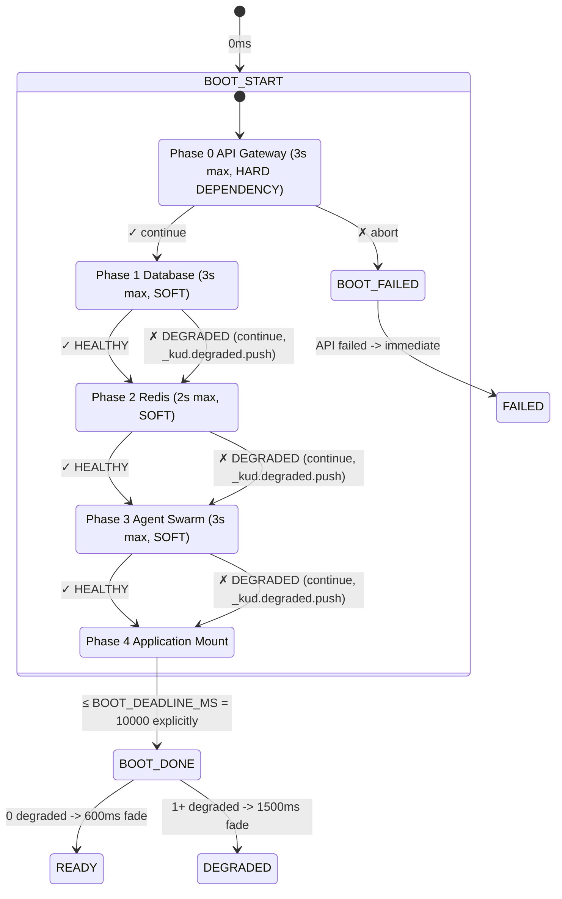

# KUDBEE System Architecture Manifest

**CONTEXT:**
KUDBEE is a frozen-production monorepo (Node 22, npm 10.9.8) at commit `f423c14` / `v342`. PR #228 is the single active change lane. GitHub Actions is blocked by billing — independent CI is the verification authority. C4769 (0.4769 rad synapse threshold) is immutable. Redis uses REST facade, not TCP. Production is frozen — no deploy, no restart, no config change.

---

## 1. FULL MIDDLEWARE PIPELINE MAP

```mermaid
graph TD
    Request[Incoming Request] --> requestTimer[requestTimer<br/>FAIL-OPEN]
    requestTimer --> spheroidAudit[spheroidAudit Phase 66 ledger<br/>FAIL-OPEN]
    spheroidAudit --> synProtect{SYNAPSE PROTECTION<br/>C4769 = 0.4769 rad<br/>BEFORE Auth<br/>FAIL-CLOSED}
    
    synProtect -- Level 1 Warn/60s --> bearerAuth
    synProtect -- Level 2 Block/300s --> Blocked[403 Forbidden]
    synProtect -- Level 3 Lockout/900s --> Blocked
    
    bearerAuth[bearerAuth<br/>FAIL-CLOSED] --> kiloBridge[kiloBridgeBudget<br/>FAIL-CLOSED]
    kiloBridge --> ecpSingle[ecpSingleflight<br/>FAIL-CLOSED]
    ecpSingle --> zodValidate[zodValidate<br/>FAIL-CLOSED]
    
    zodValidate --> Routes[Routes]
    
    Routes --> rHealth[/health<br/>PG + Redis + agents health]
    Routes --> rDeployStatus[/api/system/deploy-status<br/>version + uptime]
    Routes --> rTelemetry[/api/telemetry/ingest<br/>with C4769 guard]
    Routes --> rGastown[/api/gastown/dashboard<br/>DB + swarm telemetry]
    Routes --> rLifecycle[/api/system/lifecycle<br/>boot-verify health matrix]
    Routes --> rEvents[SSE /api/events<br/>connection-limited 5 max, heartbeats]
```

---

## 2. PROVIDER-AGNOSTIC CI ARCHITECTURE

```text
┌─────────────────┐       ┌──────────────────────┐
│     GITHUB      │       │    INDEPENDENT CI    │
│ ─────────────── │       │ ─────────────────────│
│ • source        │       │ • verify-gates.mjs   │
│ • PR history    │       │   - unused-imports   │
│ • code review   │       │   - typecheck        │
│ • billing issue │       │   - lint             │
│   (external)    │       │   - build            │
│ STATUS: BLOCKED │       │ • verify-e2e.mjs     │
│ (not app fault) │       │   (38 checks)        │
└────────┬────────┘       │ • verify-agents.mjs  │
         │                │ • boot-verify.mjs    │
         ▼                │ STATUS: OPERATIONAL  │
       SOURCE             └──────────┬───────────┘
         │                           │
         ▼                           ▼
┌─────────────────┐       ┌──────────────────────┐
│     HEROKU      │       │ TEMPORAL TECHNICIAN  │
│ ─────────────── │       │ ─────────────────────│
│ • staging       │       │ • event ledger (6)   │
│ • production    │       │ • snapshots (2)      │
│ • formation API │       │ • whatChanged()      │
│ • build history │       │ • trace()            │
│   (200 builds)  │       │                      │
│   TARGET ONLY   │       │    READ-ONLY         │
│                 │       │    EVIDENCE ONLY     │
│ ─────────────── │       └──────────┬───────────┘
│ ↓ staging verify│                  │
│ ↓ HEALTHY       │                  │
│ ↓               ▼                  │
│ ─────────────── │       ┌──────────────────────┐
│   PRODUCTION:   │       │         KILO         │
│     FROZEN      │       │ ──────────────────── │
│ ─────────────── │       │      f423c14 / v342  │
│ • observation   │       │ NO DEPLOY            │
│ • reasoning     │       │ NO RESTART           │
│ • promotion rec.│       │ NO CONFIG            │
│ • governance    │       └──────────────────────┘
└─────────────────┘
```

**Boundaries:**
- **Provider Boundary:** Between GITHUB and INDEPENDENT CI (Billing block isolates GH Actions).
- **Architectural Boundary:** Between PRODUCTION (Frozen target) and TEMPORAL TECHNICIAN (Read-only observer).

---

## 3. SYSTEM SPINE BOOT STATE MACHINE



---

## 4. CRITICAL ARCHITECTURAL INVARIANTS TABLE

| Invariant | Location | Verified? | Breakable? |
|:---|:---|:---|:---|
| C4769 = 0.4769 rad | `synapseProtectionLayer.ts:41` | ✓ CODE | NEVER — security |
| C4769 BEFORE auth | `server.js:191` (middleware order) | ✓ CODE | NEVER |
| Redis REST facade | `redisRest.js` → `redis.js` (preferred) | ✓ CODE | NO — TCP reversion |
| getBlockingRedisClient → REST | `redis.js:386-395` | ✓ CODE | NO |
| getWorkerRedisClient → REST | `redis.js:457-466` | ✓ CODE | NO |
| Retry throttle 5/min, 120s | `redis.js:70-104` | ✓ CODE | NO |
| Boot deadline 10s | `index.html` (PR #228) | ✓ CODE | NO — never infinite |
| Deploy version dynamic | `server.js:252-264` | ✓ CODE | NO — never hardcoded |
| JS MIME = application/javascript | Verified | ✓ DEPLOY | NO |
| Production frozen | Contract | CONTRACT | ONLY with explicit auth |
| PR #228 single lane | Contract | CONTRACT | NO PR #229 |
| Temporal Tech read-only | `temporalTechnician.ts` | ✓ CODE | NO — no prod mutation |

---

## 5. EVIDENCE PROVENANCE LAYER

### **LEVEL 1 — DIRECT PLATFORM EVIDENCE**
*OBSERVED* platform-level truth.
- **Example:** Heroku Formation API → `SCALE_RESTART` at `21:53:49Z`
- **Confidence:** `1.0`

### **LEVEL 2 — APPLICATION TELEMETRY**
*OBSERVED* application-level health and metrics.
- **Example:** `/health` endpoint → PG `HEALTHY`, Redis `HEALTHY`
- **Confidence:** `0.95`

### **LEVEL 3 — CORRELATED EVIDENCE**
*INFERRED* from correlating multiple observed data points.
- **Example:** Formation timestamp (Level 1) + `/health` timestamp (Level 2) → 0-second correlation delta
- **Confidence:** `0.90`

### **LEVEL 4 — INFERENCE**
*INFERRED* derived conclusions without direct verification.
- **Example:** "Production is healthy" — inferred from Level 1-3 evidence combined, but cannot directly verify live state.
- **Confidence:** `≤ 0.85`

**RULE:** Never promote Level 4 → Level 1.
